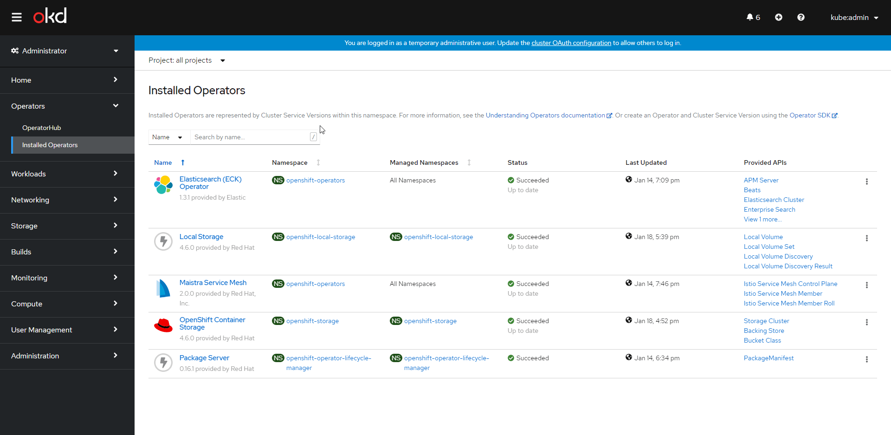
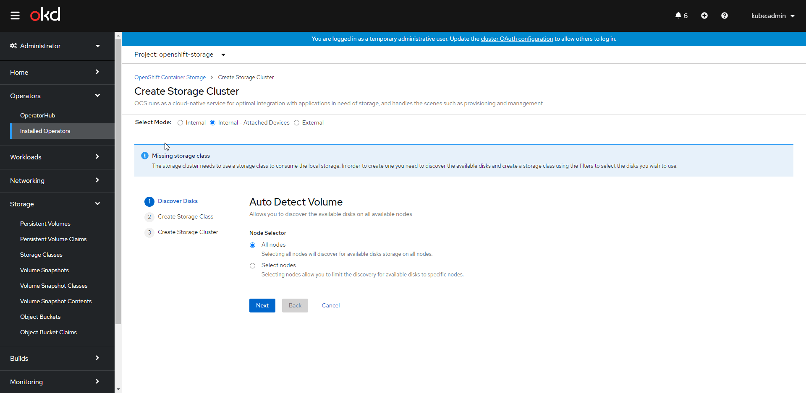
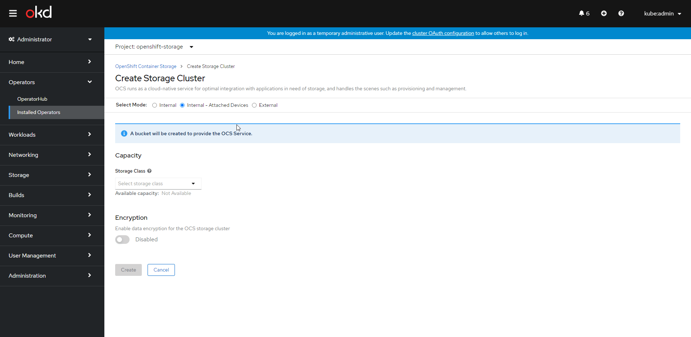

Installing Openshift Container Storage on OKD
---

# Install the Required Operators

> Install the Local Storage Operator

```bash
#TODO
```

> Install the OCS (OpenShift Container Storage) operator

```bash
oc create ns openshift-storage

cat <<EOF | oc create -f -
apiVersion: operators.coreos.com/v1
kind: OperatorGroup
metadata:
  name: openshift-storage-operatorgroup
  namespace: openshift-storage
spec:
  targetNamespaces:
  - openshift-storage
EOF

cat <<EOF | oc create -f -
apiVersion: operators.coreos.com/v1alpha1
kind: CatalogSource
metadata:
  name: ocs-catalogsource
  namespace: openshift-marketplace
spec:
  sourceType: grpc
  image: quay.io/<IMAGE-NAMESPACE>/ocs-registry:4.6.0
  displayName: OpenShift Container Storage
  publisher: Red Hat
EOF
```
Make sure to replace \<IMAGE-NAMESPACE>!

> ⏱️ Wait about 15 minutes before proceeding to the next step. OKD is asynchronously installing the required operators.

# Label the Nodes

OpenShift Container Storage requires at least 3 nodes to operate correctly. You must label these nodes as "available" so OpenShift Container Storage can populate them with infrastructure and use their disks.

You can label a node with the following command:

```bash
oc label nodes <NODE-FQDN> cluster.ocs.openshift.io/openshift-storage=''
```

# Configure the Operators

Open the OKD web interface.

Select the "Administrator" view.

Select "Operators → Installed Operators" on the left navigation menu

You should now see an interface like the following:



If you are missing the "Local Storage" or "OpenShift Container Storage" packages:

- Ensure that you have selected "All Projects" on the top navigation pane
- Ensure that you have waited at least 15 minutes since running the install commands and the operators are not still installing.

Next, select the OpenShift Container Storage Operator.

Navigate the following: Storage Cluster Tab → Create Storage Cluster

You should see the Storage Cluster Creation page.  **If it does not look similar at first, ensure you have "Internal - Attached Devices" selected at the top.**



Next select All Nodes or Select Nodes based on your deployment. If you are unsure, select All Nodes. This will allow the storage cluster to span across all available Storage nodes.

Next, give your Volume Set a name. In this case I have chosen `my-example-volumeset`.


💡 Despite us having 1.4 TiB of available Raw disk capacity, we will only have approximately 500GB usable due to redundancy.

Click the NEXT button and you should see a page like the following: 


1. Select your Storage Class that you created in the previous step.
2. ENABLE / DISABLE Encryption based on the usage of the volume (You can't change this later)
3. Ensure all of your desired storage nodes are populated in the Nodes list.
4. Smack the create button

**OpenShift will now install the Storage Operator. Time to sit back, cross your fingers and hope that it works.**

# Troubleshooting

## When opening the "Create Storage Cluster" window, it shows an interface like the following:



Solution: If OKD detects existing Storage Classes, it won't let you use the easy setup wizard. You can either manually create a Local Volume Spec or remove the existing storage classes.

## When trying to create the storage cluster, one or more of the nodes is missing from the list.

Solution: This is often caused by an old hold on the drive from a previous volume.

> Log into the impacted nodes (the ones missing from the list)

```bash
oc debug node/NODE-FQDN
```

> List the available claim mount points

```bash
ls /mnt/local-storage/
```

Sample output:

```console
sh-5.0# ls /mnt/local-storage/
an-old-volume  my-example-volumeset
sh-5.0# 
```

In our case, we can see an old `an-old-volume`.  We want to remove any symlinks inside of that folder.

```bash
rm /mnt/local-storage/an-example-volume/*
```

Now after a few minutes, the node should show up on the list.